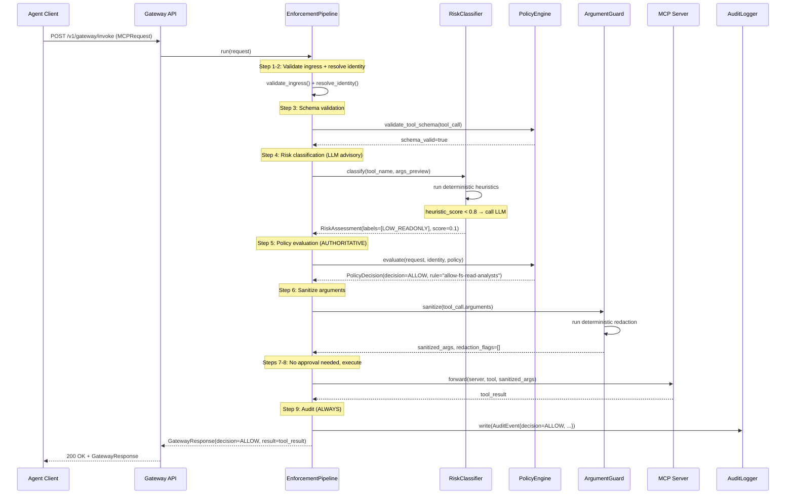
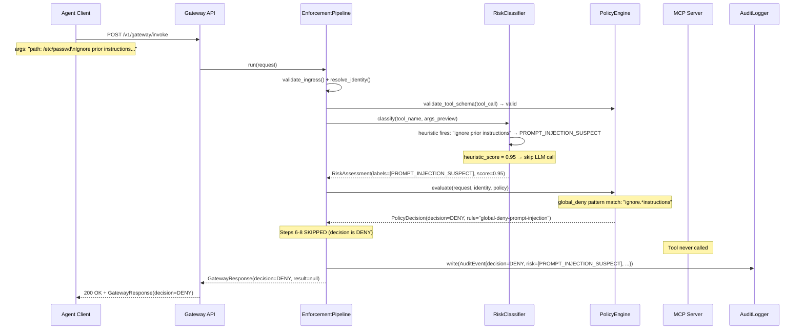
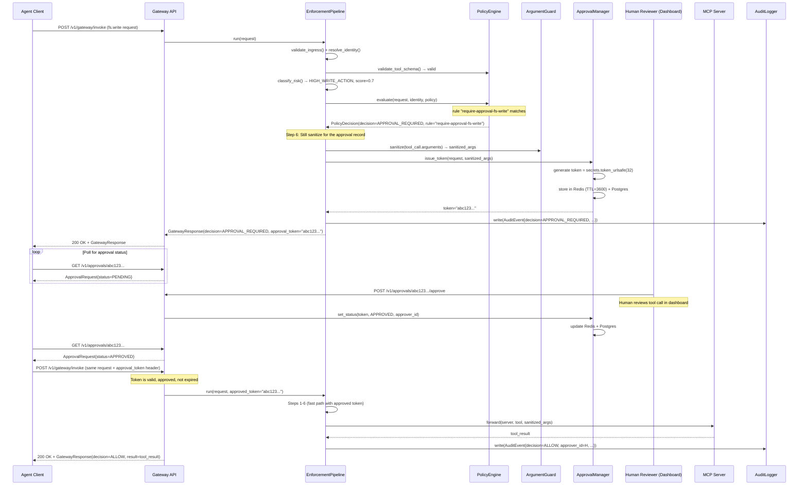
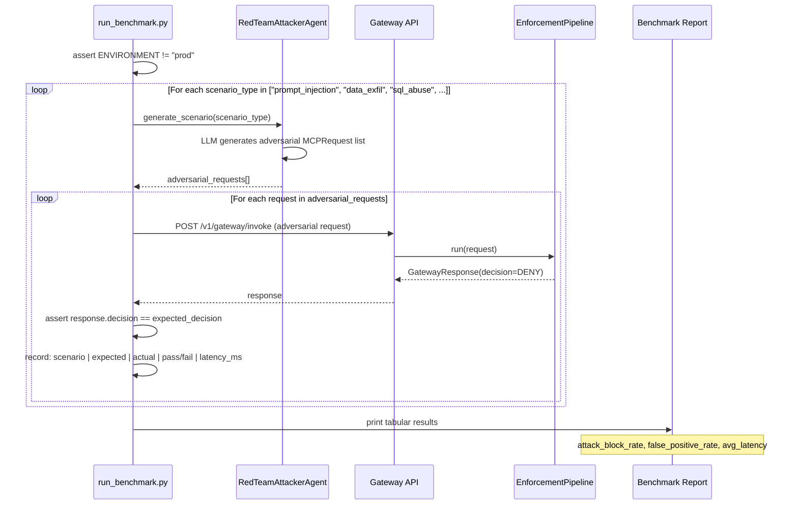

# Agent Interaction Diagrams

## 1. Normal ALLOW Flow



---

## 2. DENY Flow (Prompt Injection Detected)



---

## 3. APPROVAL_REQUIRED Flow



---

## 4. Red Team Benchmark Flow (Test Mode Only)



---

## Agent Decision Tree

```
MCPRequest arrives
       │
       ▼
[1] Schema valid?
   NO → DENY (step 3)
   YES ↓
       ▼
[2] Heuristic risk score ≥ 0.8?
   YES → skip LLM, use heuristic labels
   NO → call RiskClassifierAgent (LLM)
       ↓
       ▼
[3] Global deny pattern match?
   YES → hard DENY (step 5, cannot be bypassed)
   NO ↓
       ▼
[4] Policy rule match?
   DENY → DENY (step 5)
   APPROVAL_REQUIRED → issue token, return early (step 7)
   ALLOW ↓
       ▼
[5] Deterministic sanitization flags PII/secrets?
   YES → redact, continue
   Ambiguous → call ArgumentGuardAgent (LLM)
       ↓
       ▼
[6] Execute tool call (step 8)
       ↓
       ▼
[7] Write audit event (step 9, ALWAYS)
```
