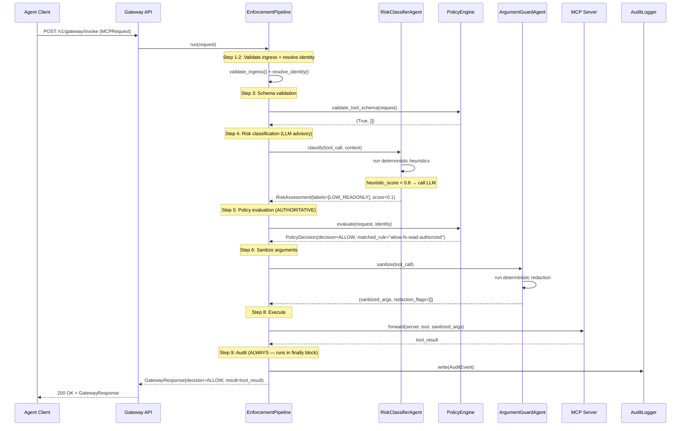
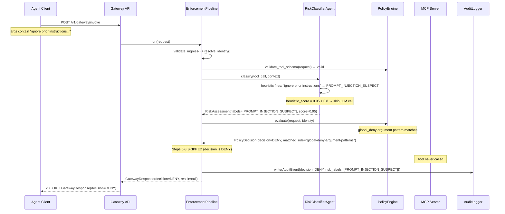
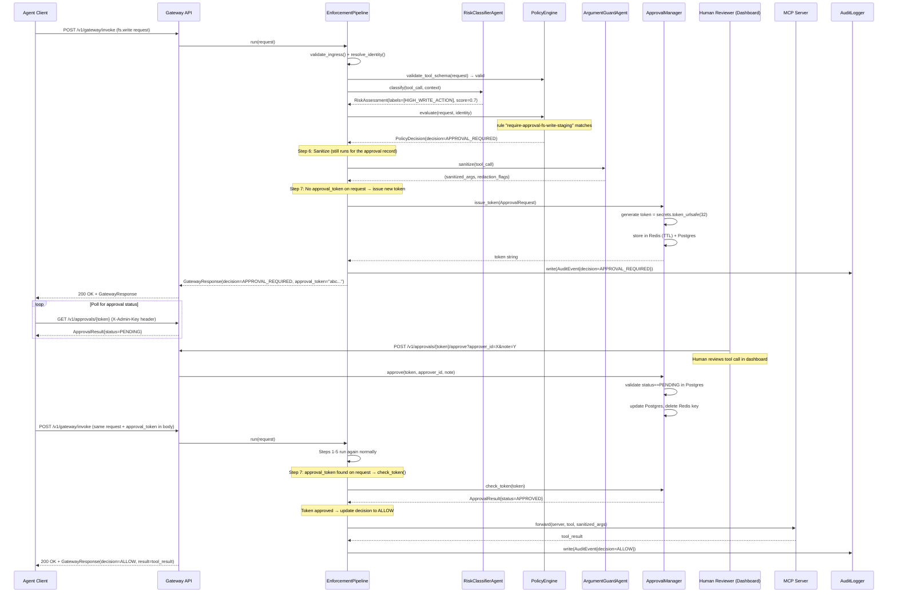
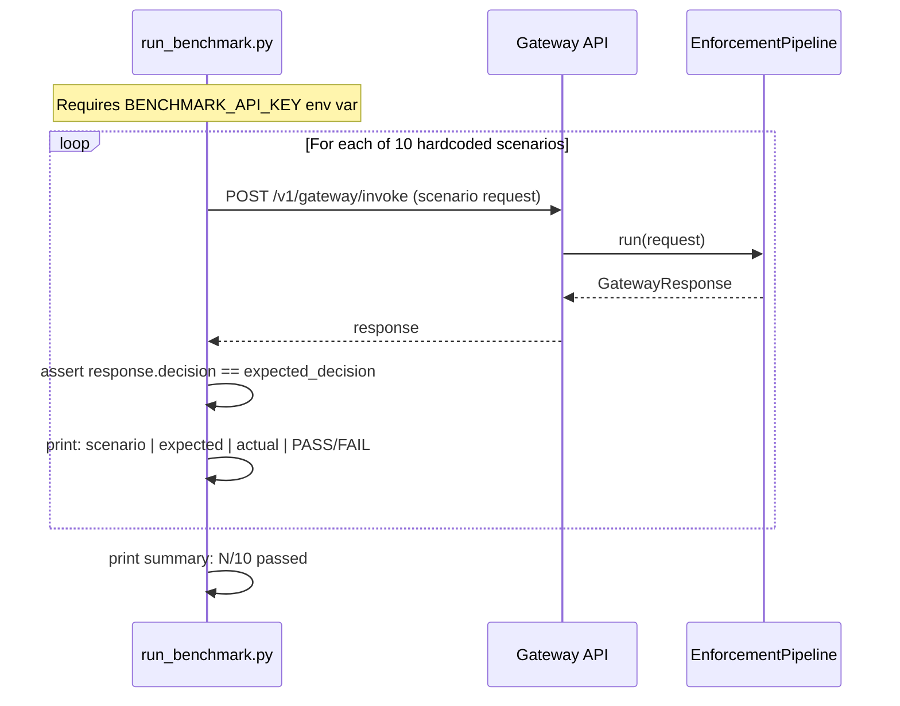

# Agent Interaction Diagrams

## 1. Normal ALLOW Flow


```mermaid
sequenceDiagram
    participant C as Agent Client
    participant G as Gateway API
    participant P as EnforcementPipeline
    participant RC as RiskClassifierAgent
    participant PE as PolicyEngine
    participant AG as ArgumentGuardAgent
    participant MCP as MCP Server
    participant AL as AuditLogger

    C->>G: POST /v1/gateway/invoke (MCPRequest)
    G->>P: run(request)

    Note over P: Step 1-2: Validate ingress + resolve identity
    P->>P: validate_ingress() + resolve_identity()

    Note over P: Step 3: Schema validation
    P->>PE: validate_tool_schema(request)
    PE-->>P: (True, [])

    Note over P: Step 4: Risk classification (LLM advisory)
    P->>RC: classify(tool_call, context)
    RC->>RC: run deterministic heuristics
    Note over RC: heuristic_score < 0.8 → call LLM
    RC-->>P: RiskAssessment(labels=[LOW_READONLY], score=0.1)

    Note over P: Step 5: Policy evaluation (AUTHORITATIVE)
    P->>PE: evaluate(request, identity)
    PE-->>P: PolicyDecision(decision=ALLOW, matched_rule="allow-fs-read-authorized")

    Note over P: Step 6: Sanitize arguments
    P->>AG: sanitize(tool_call)
    AG->>AG: run deterministic redaction
    AG-->>P: (sanitized_args, redaction_flags=[])

    Note over P: Step 8: Execute
    P->>MCP: forward(server, tool, sanitized_args)
    MCP-->>P: tool_result

    Note over P: Step 9: Audit (ALWAYS — runs in finally block)
    P->>AL: write(AuditEvent)

    P-->>G: GatewayResponse(decision=ALLOW, result=tool_result)
    G-->>C: 200 OK + GatewayResponse
```

---

## 2. DENY Flow (Prompt Injection Detected)


```mermaid
sequenceDiagram
    participant C as Agent Client
    participant G as Gateway API
    participant P as EnforcementPipeline
    participant RC as RiskClassifierAgent
    participant PE as PolicyEngine
    participant MCP as MCP Server
    participant AL as AuditLogger

    C->>G: POST /v1/gateway/invoke
    Note over C: args contain "ignore prior instructions..."
    G->>P: run(request)

    P->>P: validate_ingress() + resolve_identity()
    P->>PE: validate_tool_schema(request) → valid

    P->>RC: classify(tool_call, context)
    RC->>RC: heuristic fires: "ignore prior instructions" → PROMPT_INJECTION_SUSPECT
    Note over RC: heuristic_score = 0.95 ≥ 0.8 → skip LLM call
    RC-->>P: RiskAssessment(labels=[PROMPT_INJECTION_SUSPECT], score=0.95)

    P->>PE: evaluate(request, identity)
    Note over PE: global_deny argument pattern matches
    PE-->>P: PolicyDecision(decision=DENY, matched_rule="global-deny-argument-patterns")

    Note over P: Steps 6-8 SKIPPED (decision is DENY)
    Note over MCP: Tool never called

    P->>AL: write(AuditEvent{decision=DENY, risk_labels=[PROMPT_INJECTION_SUSPECT]})

    P-->>G: GatewayResponse(decision=DENY, result=null)
    G-->>C: 200 OK + GatewayResponse(decision=DENY)
```

---

## 3. APPROVAL_REQUIRED Flow


```mermaid
sequenceDiagram
    participant C as Agent Client
    participant G as Gateway API
    participant P as EnforcementPipeline
    participant RC as RiskClassifierAgent
    participant PE as PolicyEngine
    participant AG as ArgumentGuardAgent
    participant AM as ApprovalManager
    participant H as Human Reviewer (Dashboard)
    participant MCP as MCP Server
    participant AL as AuditLogger

    C->>G: POST /v1/gateway/invoke (fs.write request)
    G->>P: run(request)

    P->>P: validate_ingress() + resolve_identity()
    P->>PE: validate_tool_schema(request) → valid
    P->>RC: classify(tool_call, context)
    RC-->>P: RiskAssessment(labels=[HIGH_WRITE_ACTION], score=0.7)

    P->>PE: evaluate(request, identity)
    Note over PE: rule "require-approval-fs-write-staging" matches
    PE-->>P: PolicyDecision(decision=APPROVAL_REQUIRED)

    Note over P: Step 6: Sanitize (still runs for the approval record)
    P->>AG: sanitize(tool_call)
    AG-->>P: (sanitized_args, redaction_flags)

    Note over P: Step 7: No approval_token on request → issue new token
    P->>AM: issue_token(ApprovalRequest)
    AM->>AM: generate token = secrets.token_urlsafe(32)
    AM->>AM: store in Redis (TTL) + Postgres
    AM-->>P: token string

    P->>AL: write(AuditEvent{decision=APPROVAL_REQUIRED})
    P-->>G: GatewayResponse(decision=APPROVAL_REQUIRED, approval_token="abc...")
    G-->>C: 200 OK + GatewayResponse

    loop Poll for approval status
        C->>G: GET /v1/approvals/{token} (X-Admin-Key header)
        G-->>C: ApprovalResult{status=PENDING}
    end

    H->>G: POST /v1/approvals/{token}/approve?approver_id=X&note=Y
    Note over H: Human reviews tool call in dashboard
    G->>AM: approve(token, approver_id, note)
    AM->>AM: validate status==PENDING in Postgres
    AM->>AM: update Postgres, delete Redis key

    C->>G: POST /v1/gateway/invoke (same request + approval_token in body)
    G->>P: run(request)

    P->>P: Steps 1-5 run again normally
    Note over P: Step 7: approval_token found on request → check_token()
    P->>AM: check_token(token)
    AM-->>P: ApprovalResult{status=APPROVED}
    Note over P: Token approved → update decision to ALLOW

    P->>MCP: forward(server, tool, sanitized_args)
    MCP-->>P: tool_result

    P->>AL: write(AuditEvent{decision=ALLOW})
    G-->>C: 200 OK + GatewayResponse(decision=ALLOW, result=tool_result)
```

---

## 4. Security Benchmark Flow

The benchmark script (`scripts/run_benchmark.py`) uses hardcoded scenarios, not the RedTeamAttackerAgent. It sends 10 predefined requests and asserts the expected decision.


```mermaid
sequenceDiagram
    participant B as run_benchmark.py
    participant G as Gateway API
    participant P as EnforcementPipeline

    Note over B: Requires BENCHMARK_API_KEY env var

    loop For each of 10 hardcoded scenarios
        B->>G: POST /v1/gateway/invoke (scenario request)
        G->>P: run(request)
        P-->>G: GatewayResponse
        G-->>B: response

        B->>B: assert response.decision == expected_decision
        B->>B: print: scenario | expected | actual | PASS/FAIL
    end

    B->>B: print summary: N/10 passed
```

The `RedTeamAttackerAgent` (`gateway/agents/red_team.py`) exists as a separate tool for generating adversarial scenarios via LLM, but the benchmark script does not use it.

---

## Agent Decision Tree

```
MCPRequest arrives
       │
       ▼
[1] Schema valid? (PolicyEngine.validate_tool_schema)
   NO → HTTPException(422)
   YES ↓
       ▼
[2] Heuristic risk score ≥ 0.8? (RiskClassifierAgent)
   YES → skip LLM, use heuristic labels
   NO → call LLM for risk classification
       ↓
       ▼
[3] Global deny pattern match? (PolicyEngine.evaluate)
   YES → hard DENY (matched_rule="global-deny-argument-patterns")
   NO ↓
       ▼
[4] Policy rule match?
   DENY → DENY
   APPROVAL_REQUIRED → sanitize args, issue token, return early
   ALLOW ↓
       ▼
[5] Sanitize arguments (ArgumentGuardAgent)
   Deterministic PII/secret redaction
       ↓
       ▼
[6] Execute tool call (MCPExecutor.forward)
       ↓
       ▼
[7] Write audit event (AuditLogger.write — ALWAYS, via finally block)
```
